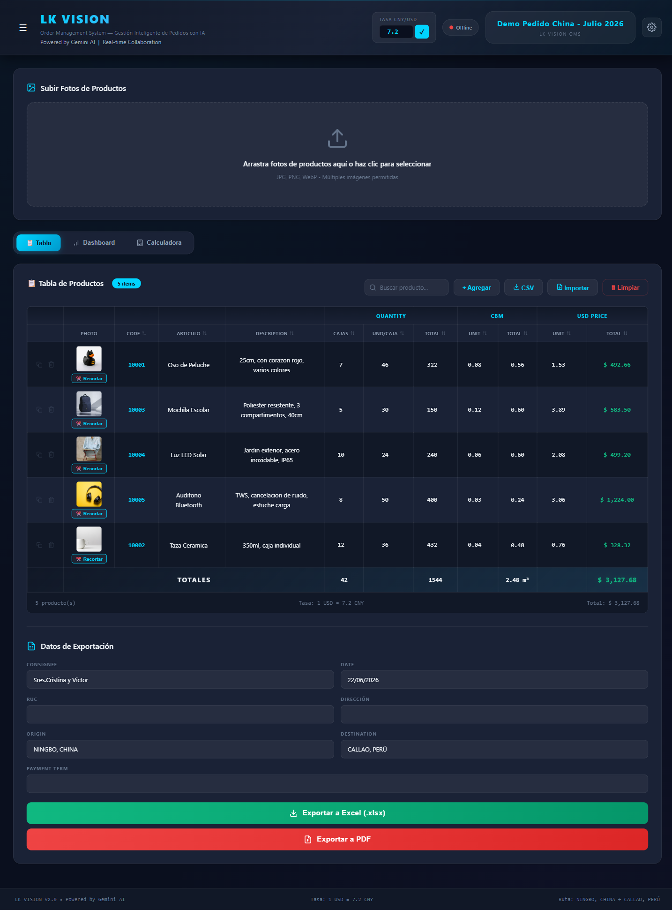
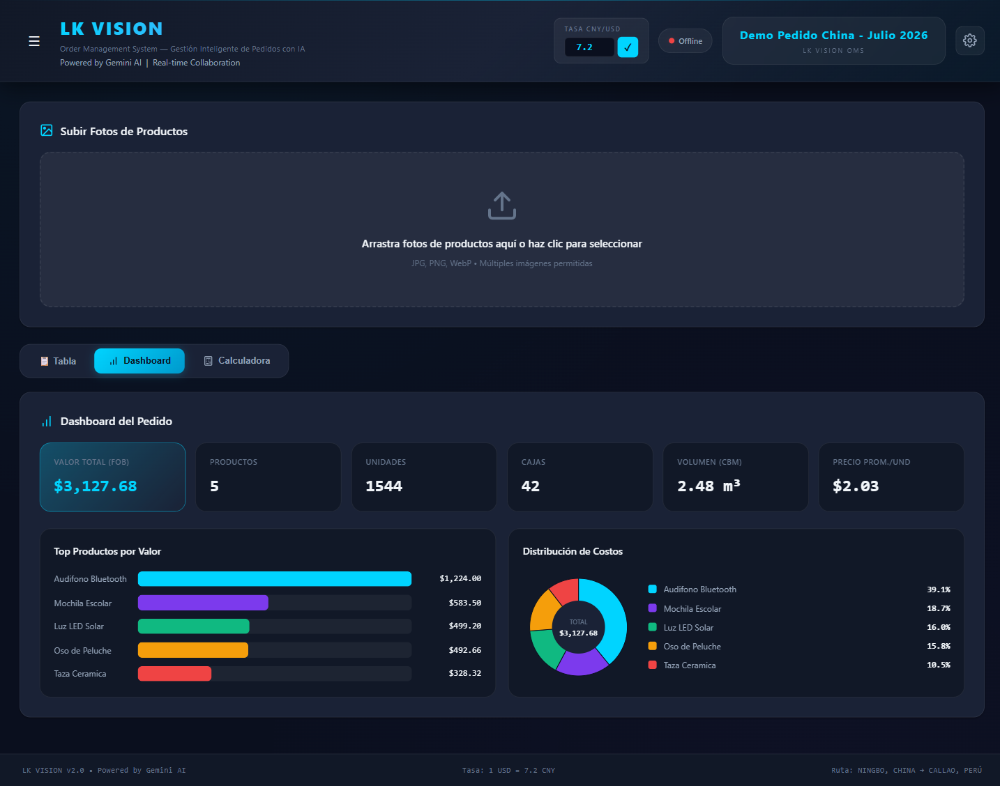
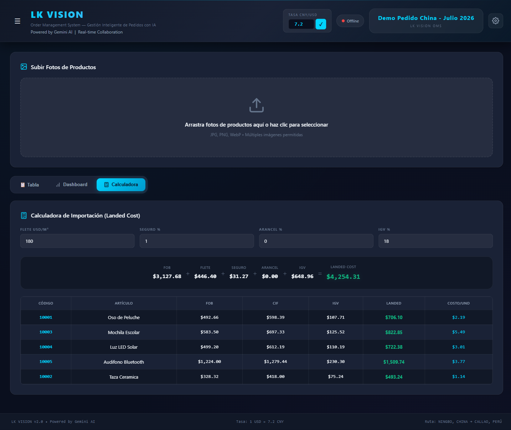
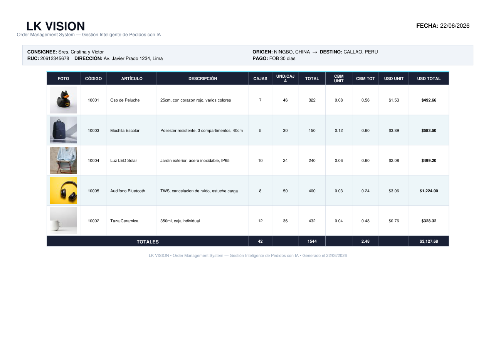

<div align="center">

# 🚀 LK VISION

### Order Management System con Inteligencia Artificial

**Convierte fotos de productos en órdenes de compra listas para exportar — en minutos, no horas.**

*Diseñado para importadores, traders y agentes de compra China → LATAM.*


### [🌐 Probar la Demo en Vivo →](https://lkvision.eleka.me)

[](https://lkvision.eleka.me)

</div>

---

## 💡 El Problema

Los agentes de compra en China fotografían productos en bodegas con precios, cantidades y volúmenes escritos a mano. Pasar esa información a una hoja de Excel toma **horas de digitación manual**, con errores de tipeo y conversiones de moneda equivocadas.

## ✅ La Solución

**LK VISION** usa visión por IA (Google Gemini) para leer las fotos automáticamente: detecta cada producto, lee el texto manuscrito, convierte CNY → USD, calcula totales y genera una orden profesional en **Excel y PDF** lista para enviar al proveedor o al cliente.

> ⏱️ **Reduce el tiempo de digitación de 30+ minutos a menos de 2 minutos por foto.**

---

## ✨ Funcionalidades

| | Característica | Descripción |
|---|---|---|
| 🤖 | **IA de Visión** | Gemini detecta productos, lee precios/cantidades/volúmenes manuscritos y los estructura automáticamente |
| ✂️ | **Smart Crop** | Recorte automático e individual de cada producto + editor manual de recorte |
| 📊 | **Dashboard** | KPIs y gráficos: valor por producto, volumen, distribución de costos |
| 🧮 | **Calculadora de Importación** | Costo *landed* por producto: flete por CBM, seguro, arancel e IGV (Perú) |
| 🏷️ | **White-Label** | Personaliza nombre, logo, datos y colores. **Véndelo a múltiples clientes sin tocar código** |
| 📋 | **Tabla Inteligente** | Edición tipo Excel, recálculo en vivo, búsqueda, ordenamiento y duplicar fila |
| 📤 | **Exportación** | Excel (.xlsx) y PDF profesional con fotos embebidas — **100% local, sin APIs de pago** |
| 🔄 | **Import/Export CSV** | Migra desde tus hojas existentes en segundos |
| 👥 | **Tiempo Real** | Colaboración multi-usuario vía WebSocket |
| 💾 | **Persistencia** | Proyectos guardados en base de datos local (SQLite) |

---

## 📸 Capturas

### Tabla de productos inteligente


### Dashboard con estadísticas


### Calculadora de costo de importación (Landed Cost)


### Exportación PDF profesional (con tu marca)


---

## 🏗️ Arquitectura

```
┌─────────────────┐     ┌──────────────────┐     ┌─────────────────┐
│  Frontend       │ ──▶ │  Backend         │ ──▶ │  Google Gemini  │
│  React 19 +Vite │     │  FastAPI +SQLite │     │  2.5 Flash (IA) │
└─────────────────┘     └──────────────────┘     └─────────────────┘
   Tabla editable          Lógica de negocio         Visión + OCR
   Dashboard / Calc        Export Excel/PDF/CSV       Bounding boxes
   White-label UI          WebSocket realtime
```

**Stack:** React 19 · Vite 6 · TanStack Table · FastAPI · SQLAlchemy · SQLite · Google Gemini · openpyxl · reportlab

---

## 🚀 Instalación

### Requisitos
- Python 3.10+
- Node.js 18+
- API Key de Google Gemini ([gratis aquí](https://aistudio.google.com/apikey))

### Backend
```bash
cd backend
pip install -r requirements.txt
# Crea backend/.env con tu key:
#   GEMINI_API_KEY=tu_api_key
python -m uvicorn app.main:app --reload --port 8000
```

### Frontend
```bash
cd frontend
npm install
npm run dev
```

### Windows (todo de una vez)
```bash
start.bat
```

| Servicio | URL |
|----------|-----|
| Frontend | http://localhost:5173 |
| API | http://localhost:8000 |
| Documentación API | http://localhost:8000/docs |

> 💡 Sin API key, la app corre en **modo demo** (todo funciona excepto el procesamiento de fotos con IA).

---

## 🏷️ White-Label — Listo para Vender

LK VISION fue diseñado para **revenderse**. Desde el panel de **Configuración** (⚙️), cualquier cliente personaliza:

- Nombre de empresa, eslogan y logo
- Dirección, teléfono, email y RUC
- Colores de marca (primario y secundario)
- Valores por defecto (origen, destino, consignatario)

Todo se refleja automáticamente en la interfaz, el Excel y el PDF. **Un solo código, infinitos clientes.**

---

## 📋 API (principales endpoints)

| Método | Ruta | Descripción |
|--------|------|-------------|
| `POST` | `/api/projects/{id}/upload-and-process` | Subir fotos + procesar con IA |
| `POST` | `/api/import-calc` | Calcular costo landed |
| `POST` | `/api/export` · `/api/export-pdf` · `/api/export-csv` | Exportar |
| `POST` | `/api/projects/{id}/import-csv` | Importar productos |
| `GET/PUT` | `/api/company-settings` | Configuración white-label |
| `WS` | `/api/ws/{projectId}` | Colaboración en tiempo real |

Documentación interactiva completa en `/docs`.

---

## 📄 Licencia

Software comercial. Para licencias, demos o personalizaciones, contactar al autor.

---

<div align="center">

**LK VISION** · Gestión Inteligente de Pedidos con IA

</div>
